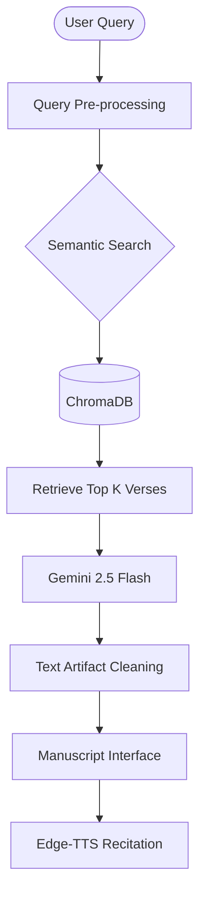

# 🕉️ Gyan Bharatam: Bhagavad Gita Knowledge Engine

[](https://www.python.org/)
[](https://flask.palletsprojects.com/)
[](https://ai.google.dev/)

**Gyan Bharatam** is a high-accuracy **RAG (Retrieval-Augmented Generation)** system built to provide authentic insights from the Bhagavad Gita. By combining local semantic search with Google's most advanced reasoning models, it delivers scriptural answers in Sanskrit, Hindi, and English with **zero hallucinations**.

---

## 🏗️ System Architecture & Flow

The system utilizes a specialized RAG pipeline designed to handle ancient multilingual datasets.


### **The Logic Flow**

Ingestion: 701 verses are processed and stored as high-dimensional vectors in ChromaDB.

Retrieval: When a query is received, the system calculates the semantic similarity to find the most relevant shlokas.

Generation: Gemini 2.5 Flash synthesizes a grounded answer using only the retrieved context.

Refinement: Post-generation logic removes artifacts like pipes or brackets to maintain the "Manuscript" aesthetic.

```
📁 Project Structure
Plaintext
Gyan-Bharatam/
├── app.py                # Main Flask application & API routes
├── config.py             # Configuration for Gemini API & Vector DB
├── generator.py          # AI response generation & artifact cleaning
├── retriever.py          # Vector search logic for ChromaDB
├── data/
│   └── chroma_db/        # Persistent vector database storage
├── static/
│   ├── css/
│   │   └── style.css     # Divine Manuscript UI & Stop button visuals
│   ├── images/
│   │   └── chariot.jpg   # Background artwork asset
│   └── audio/            # (GitIgnored) Runtime recitation files
└── templates/
    └── index.html        # Interactive frontend with Stop/Listen logic
```
✨ Key Features
🎯 Contextual Accuracy: Powered by a verified dataset of 701 verses to prevent AI fabrication.

🔍 Intent-Aware Search: Handles both direct verse lookup (e.g., "18.66") and conceptual topics like Karma or Yoga.

📜 Ancient UI Theme: A custom parchment-style interface that mirrors the look of ancient manuscripts.

🔊 Scripture Recitation: Real-time TTS for Sanskrit shlokas and Hindi/English translations.

🚀 Getting Started
Installation
Clone the Repository:

Bash
git clone [https://github.com/SwastikCr7g/Gyan-Bharatam.git](https://github.com/SwastikCr7g/Gyan-Bharatam.git)
cd Gyan-Bharatam
Setup Environment:

Bash
python -m venv .venv
.\.venv\Scripts\activate  # Windows
pip install -r requirements.txt
Run the Engine:

Bash
python app.py
🏆 Project Impact
Developed during my AI/ML Internship at Immverse AI, this project demonstrates the ability of RAG architectures to bridge traditional scriptural wisdom with modern AI reasoning.